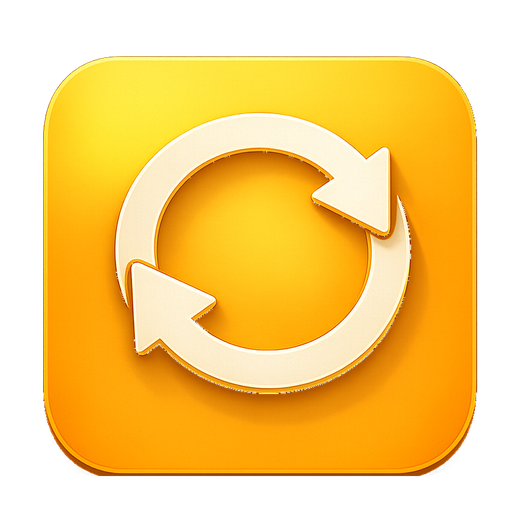

<p align="center">
  
</p>

<h1 align="center">Converta</h1>

<p align="center">
  A tiny, native macOS app that converts video files between formats — drag, drop, convert.
</p>


## Features

- Drag & drop (or click to browse) a video file onto the input tile
- Pick input/output formats: **webm, mp4, mov, mkv, avi, gif**
- Set your preferred default conversion pair in Settings (`⌘,`) — applied on launch
- Choose an output folder, hit Convert — the button turns into a one-click "Show in Finder" once it's done
- Runs on [FFmpeg](https://ffmpeg.org) under the hood, installed automatically via Homebrew

## Requirements

- macOS 13 (Ventura) or later
- Xcode Command Line Tools (Swift 5.9+)

## Install via Homebrew

```bash
brew tap PavlovIvan1/converta https://github.com/PavlovIvan1/converta.git && brew trust pavlovivan1/converta && brew install converta
```

Installs into `/Applications` and shows up in Launchpad/Spotlight. `ffmpeg` is pulled in automatically as a dependency — nothing else to install by hand.

The cask builds the app from source on your machine instead of downloading a prebuilt binary, so Gatekeeper doesn't block it and no Apple notarization is required.

## Build from source

```bash
git clone git@github.com:PavlovIvan1/converta.git
cd converta
swift run
```

## Build a `.app` bundle

```bash
./build_app.sh
open Converta.app
```

## License

MIT — see [LICENSE](LICENSE).
